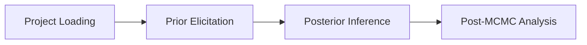

# User Guide

> [!Warning]
> The PolyChron User guide is under development.

## Getting Started

PolyChron is not yet available via `pip` / [PyPI](https://pypi.org/), but can be installed locally from source.

For detailed installation instructions, please see the [PolyChron Readme for local installation instructions](https://github.com/bryonymoody/PolyChron).

## Using PolyChron

Once installed, polychron can be launched from the command line, via the execution script or as a python module.

```console
$ polychron

$ python3 -m polychron
```

PolyChron supports several command line options for additional usage, such as `--version` or `--verbose`

```console
$ polychron --version
PolyChron 0.2.0
```

```console
$ polychron --verbose
```

For more information, use the `-h` or `--help` options

```console
$ polychron --help
```

Once launched, there are there are 4 main sections when using PolyChron.



>[!WARNING]
> @todo -  improve the user guide with additional sections
