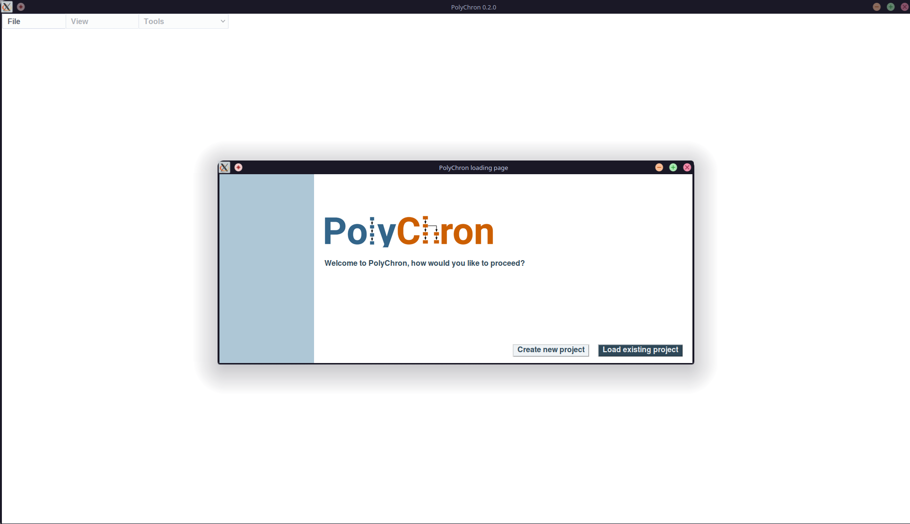
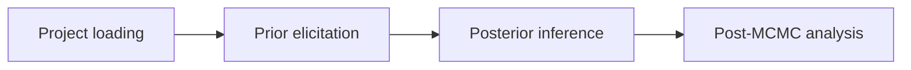

# Using PolyChron

## Installing PolyChron

For installation instructions, see [Getting Started](../getting-started.md).

## Launching PolyChron

Once installed, `polychron` can be launched from the command line.

```bash
# via the executable script
polychron
# or by running the installed polychron module
python3 -m polychron
```

On launch, you should see a window as below.



The version of polychron may be checked using `--version`

```bash
polychron --version
```

For full command line options, see `-h` / `--help`

```bash
polychron --help
```

## The PolyChron Workflow

Usage of polychron can be split into a 4 stage workflow:



### Project Loading

Project Loading allows the user to create or select a *project* and *model* to manipulate and interrogate.

See [Project Loading](./project-loading.md) for more information.

### Prior Elicitation

Prior Elicitation involves building and manipulating a *model* with *stratigraphic relationships*, *context grouping*, *group orderings* and *dating information* to form the *stratigraphic graph*.

The stratigraphic graph can then be combined with additional information, such as identify *residual* & *intrusive* contexts; and the *types of group relationships*, to form the *chronological graph*.

See [Prior Elicitation](./prior-elicitation.md) for more information.

### Posterior Inference

Once the user has loaded the *chronological graph* for a given *model*, *posterior estimates* can be computed using a Monte Carlo Markov Chain (MCMC) algorithm.

See [Posterior Inference](./posterior-inference.md) for more information.

### Post-MCMC Analysis

Finally, once the posterior inference is complete and the minimum required number of MCMC samples has been met, users can interrogate the MCMC results including *marginal HPD intervals* and *posterior probability density plots*.

See [Post-MCMC Analysis](./post-mcmc-analysis.md) for more information.

## Configuration

PolyChron has several application-wide configuration parameters. See [Configuration](configuration.md) for more details.
