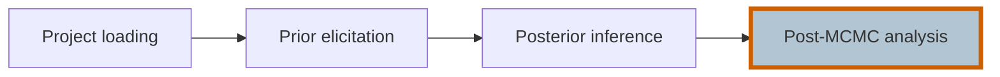
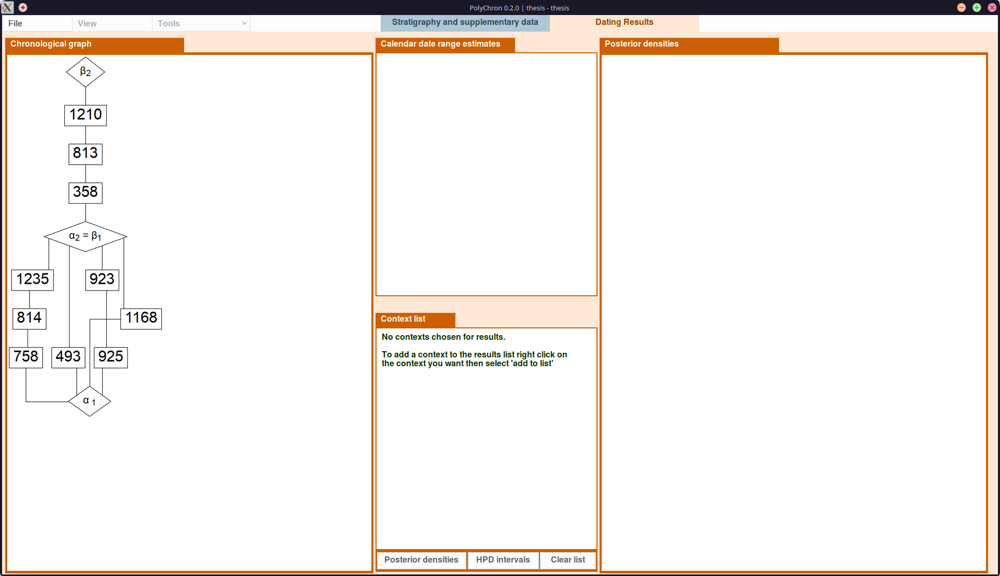
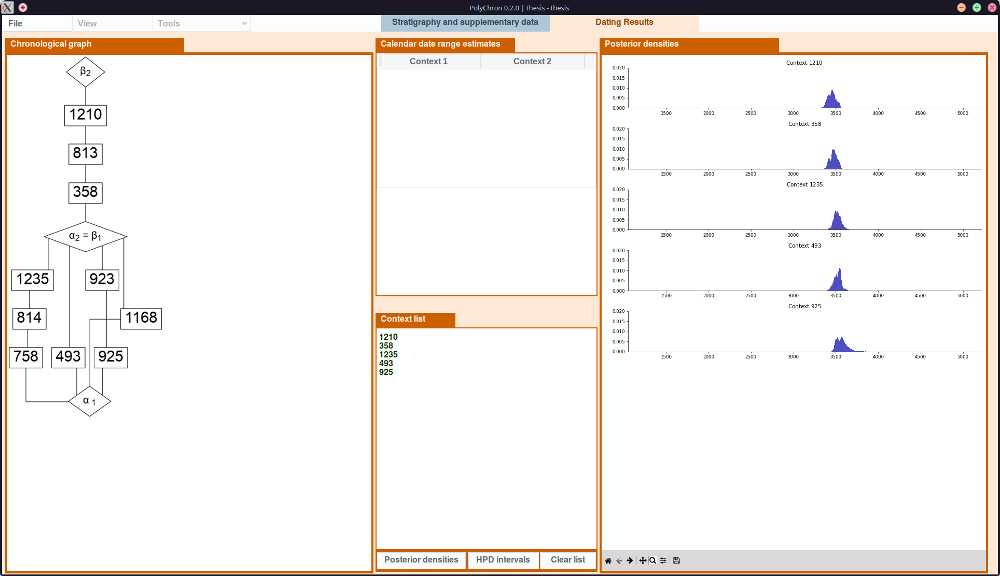
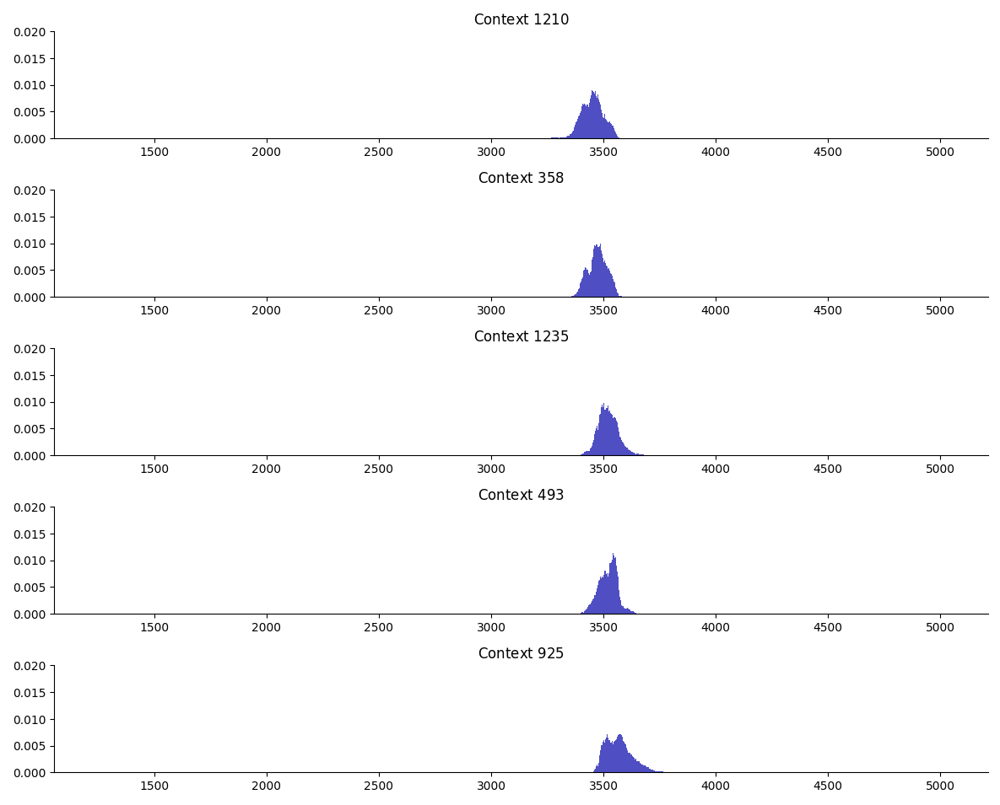
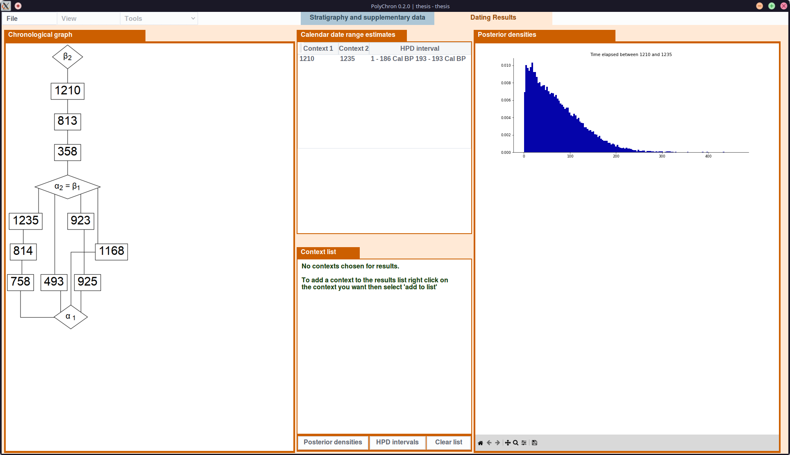

# Post-MCMC analysis

After *posterior inference* is complete and MCMC results are available for a *model*, the *Dating Results* tab can be used for post-MCMC analysis.

The *Dating Results* view includes the chronological DAG which can be used to select contexts and group boundary nodes for subsequent analysis, by right-clicking on the context/group boundary shape.

## Posterior Densities

Posterior densities for a selection of contexts or group boundary nodes can plotted by selecting nodes from the chronological graph.

Contexts or group boundaries can be selected by right-clicking on the node and selecting "*Add to results list*".

On clicking the "*Posterior densities*" button, posterior probability density plots for the selected nodes will be displayed.

The plots are interactive, and can be exported to file using the toolbar at the bottom of the plot area.

## HPD Intervals

*Marginal HPD intervals* for a selection of contexts or group boundary nodes can be displayed in the "*Calendar date range estimates*" table.

Contexts or group boundaries can be selected by right-clicking on the node and selecting "*Add to results list*".

On clicking the "*HPD intervals*" button, you will be prompted for the HPD interval percentage (95% is used as standard). On submission, HPD intervals will be computed and displayed in the "*Calendar date range estimates*" table.

## Time elapsed between contexts or group boundaries

The time elapsed between any two contexts or group boundaries can be examined by:

1. Right click on the first node, selecting "*Get time elapsed*"
2. Right click on the second node, selecting "*Get time elapsed between X and another context*"

The "*Calendar date range estimates*" table will have been updated to include the HPD interval between the two nodes, and the "*Posterior densities*" area will include a plot of the posterior density probability density plot, which can be exported if required.

## Clearing selected contexts, HPD Intervals and Posterior Densities

The "*Clear list*" button can be used to clear the selected nodes, HPD Intervals table and posterior densities plots.
