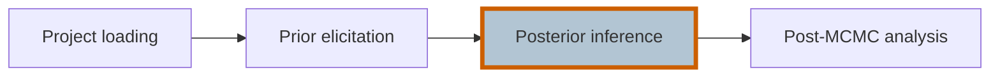
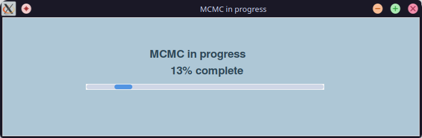

# Posterior inference

```mermaid
graph LR
    g0[Project loading];
    g1[Prior elicitation];
    g2[Posterior inference];
    g3[Post-MCMC analysis];
    g0 --> g1;
    g1 --> g2;
    g2 --> g3;

    classDef selected-mermaid-node fill:#33658a60,stroke:#cc5f00,stroke-width:4px
    class g2 selected-mermaid-node
```

After *prior elicitation*, when the chronological DAG has been produced for a *model*, users can compute joint posterior estimates for all parameters in the model following a MCMC algorithm.

## MCMC calibration

Posterior densities for the current *model* can be generated by selecting `Tools > Calibrate model` on the *stratigraphy and supplementary data* tab.

Upon selecting this option, a popup window will first appear asking whether you would like to provide a seed for the MCMC algorithm.
If *Yes* is selected, user must manually enter an integer seed between `0` and `2^31 - 1`. If *No* is selected, a random seed will be generated automatically. The chosen or generated seed will be displayed in the top-right corner of the dating results page for reference and reproducibility.

After this, the MCMC algorithm will begin, and a progress window will appear showing the status of the calibration, as shown below. Calibration may take a while to complete for larger and more complex models.

MCMC Calibration will run until a minimum number of accepted samples (`50000`) is achieved.

By default, the calibration curve used is *IntCal20*, but this can be changed by selecting `Tools > Select Calibration Curve`. The available alternatives are *Marine20* and *SHCal20*.

## Batch MCMC calibration

If you have multiple *models* within a *project*, a batch of *models* can be calibrated by selecting `Tools > Calibrate multiple models from project` and selecting models to calibrate.

Only models which have been saved after completing *prior elicitation* (i.e. models with chronological graphs) can be selected for batch calibration.

Calibrations are currently executed in sequence, but fewer accepted MCMC samples are required than for individual model sampling.
Similar to the calibration of a single model, the user will be prompted to choose whether to provide a seed before the batch calibration begins. The chosen or generated seed will be applied to all models in the batch calibration run.

## Next

Once you have calibrated your model(s), [proceed to *post-MCMC analysis*](./post-mcmc-analysis.md).

