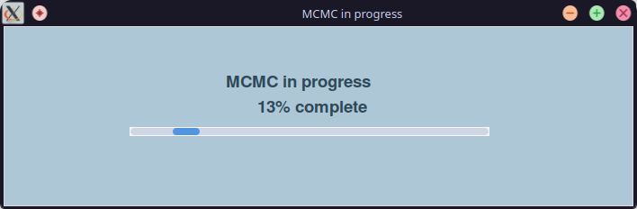

# Posterior inference

After *prior elicitation*, when the chronological DAG has been produced for a *model*, users can compute joint posterior estimates for all parameters in the model following a MCMC algorithm.

## MCMC calibration

Posterior densities for the current *model* can be generated by selecting `Tools > Calibrate model` on the *stratigraphy and supplementary data* tab.

This will initiate the MCMC algorithm with a popup window showing progress of the MCMC calibration, as shown below. Calibration may take a while to complete for larger and more complex models.

MCMC Calibration will run until a minimum number of accepted samples (`50000`) is achieved.

## Batch MCMC calibration

If you have multiple *models* within a *project*, a batch of *models* can be calibrated by selecting `Tools > Calibrate multiple models from project` and selecting models to calibrate.

Only models which have been saved after completing *prior elicitation* (i.e. models with chronological graphs) can be selected for batch calibration.

Calibrations are currently executed in sequence, but fewer accepted MCMC samples are required than for individual model sampling.

## Next

Once you have calibrated your model(s), [proceed to *post-MCMC analysis*](./post-mcmc-analysis.md).

