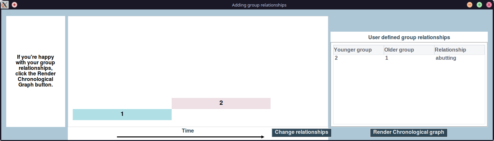

# Prior elicitation


Prior Elicitation involves building and manipulating a *model* with *stratigraphic relationships*, *context grouping*, *group orderings* and *dating information* to form the *stratigraphic graph*.

The stratigraphic graph can then be combined with additional information, such as identify *residual* & *intrusive* contexts; and the *types of group relationships*, to form the *chronological graph*.

When a model has been created or selected, the *stratigraphy and supplementary data* tab will have been opened in the main window:


## Building the stratigraphic DAG

There are 4 mandatory input files which must be provided for a model.

### Input stratigraphic relationships

The stratigraphic relationships input file provides the **contexts** and the stratigraphic relationships between them.

It is a CSV file with 2 columns, with each row providing a stratigraphic relationship:

| Column  | Type  | Description          |
|---------|-------|----------------------|
| `above` | `str` | The younger context. |
| `below` | `str` | The older context, which may be omitted for unconnected contexts |

Context names must be strings which do not contain certain characters such as `:`

An example csv file from "[*Moody, Bryony (2023) Semi-Automation of Bayesian Chronology Construction Using a Graph-Theoretic Approach. PhD thesis, University of Sheffield.*](https://etheses.whiterose.ac.uk/id/eprint/33387/)":

```csv
above,below
814,758
1235,814
358,1235
813,358
1210,813
358,493
923,925
358,923
358,1168
758,
925,
493,
1168,
```

The file can be loaded into the *model* by selecting `File > Load stratigraphic relationship file (.csv)` and selecting the CSV file from disk.
A preview popup window will open, allowing you to confirm you wish to load the file or not.


Once the data has been loaded, the stratigraphic DAG will be rendered


### Input radiocarbon determinations

Radiocarbon determinations can be provided for contexts in the stratigraphic DAG from CSV file, by selecting `File > Load scientific dating file (.csv)`.
This must be after contexts have been loaded.

The CSV file must include 3 columns:

| Column    | Type    | Description                   |
|-----------|---------|-------------------------------|
| `context` | `str`   | The context label for the row |
| `date`    | `float` | The radiocarbon date in BP    |
| `error`   | `float` | The laboratory error for radiocarbon estimate |

For the example model from [*(Moody, 2023)*](https://etheses.whiterose.ac.uk/id/eprint/33387/):

```csv
context,date,error
758,3275,75
814,3270,80
1235,3400,75
493,3190,75
925,3420,65
923,3435,60
1168,3160,70
358,3340,85
813,3270,75
1210,3200,70
```

### Input context groupings

In PolyChron **contexts** belong to one of many **groups**.
These can be loaded from CSV by selecting `File > Load context grouping file (.csv)`, after the stratigraphic relationships have been loaded.

The context grouping input file is a CSV with 2 columns, where each row provides the `group` for a `context`:

| Column    | Type  | Description |
|-----------|-------|-------------|
| `context` | `str` | The context |
| `Group`   | `str` | The group for the context |

For example, the following CSV is a the context groupings file from the model used in [*(Moody, 2023)*](https://etheses.whiterose.ac.uk/id/eprint/33387/):

```csv
context,Group
758,1
814,1
1235,1
493,1
925,1
923,1
1168,1
358,2
813,2
1210,2
```

### Input group orderings

Like contexts, groups have relative relationships between one another in PolyChron.
These are loaded from a CSV file, by selecting `File > Load group relationship file (.csv)`

The CSV file must have with 2 columns, and each row provides the relationship between two groups:

| Column         | Type  | Description       |
|----------------|-------|-------------------|
| `above`        | `str` | The younger group |
| `below`        | `str` | The older group   |
| `relationship` | Optional: `abutting`, `gap`, `overlap` | Optional column containing the type of relationship. |  

For example, using the 2-group model included in [*(Moody, 2023)*](https://etheses.whiterose.ac.uk/id/eprint/33387/):

```csv
above,below
2,1
```

Or including the optional third `relationship` column specifying the relationship between `2` and `1` is `abutting`: 

```csv
above,below,relationship
2,1,abutting
```

Each group must:

- Be the `above` group in `0` or `1` relationships
- Be the `below` group in `0` or `1` relationships
- Be included in `1` or `2` relationships 
    - i.e. every defined group must be included in at least one row

## Saving the Model

PolyChron models are not saved automatically.

The model must be saved when the user is happy with the current state by selecting `File > Save changes as current model`.

Alternatively, the model can be saved as a copy, by selecting `File > Save changes as new model` and using the project selection/creation process to provide the new project and model to save as.

## Switching Model

Alternate models from the same or other projects can be opened by selecting `File > Load existing model` or `File > Load new project` respectively.

> [!WARNING]
> Remember to save any changes to the current model you wish to keep before loading another Model

## Manipulating the stratigraphic DAG

Once the stratigraphic relationships have been loaded from disk, the stratigraphic DAG can be manipulated using the right-click menu on the stratigraphic DAG.

### Adding contexts

New contexts can be added to the model by right clicking on the stratigraphic DAG and selecting `Add new contexts`.
A popup menu will be presented asking for a new context label.

> [!WARNING]
> Newly created contexts will not have groups or radiocarbon determinations, which can only be provided by CSV.

### Deleting contexts

Contexts may be removed from the stratigraphic DAG by right-clicking on a context within the stratigraphic DAG, and selecting `Delete context`.
A popup window will be created, asking for a reason why you are removing the context.

The removed context and reason for removal will be appended to the table of removed contexts.

### Adding stratigraphic relationships

New stratigraphic relationships between nodes can be added by:

1. Right-clicking on the **above context** for the directed relationship and selecting `Place above other context`
2. Right-clicking on the **below context** for the directed relationship and selecting `Place X Above"` where `X` is the *above* context

If the new relationship is valid (does not form a loop etc.), it will be added to the stratigraphic DAG, otherwise an error will be reported.

### Deleting stratigraphic relationships

Stratigraphic relationships between two contexts may be removed from the stratigraphic DAG by:

1. Right-clicking on one context in the relationship and selecting `Delete stratigraphic relationship`
2. Right-clicking on the second context in the relationship, and selecting `Delete stratigraphic relationship with X`, where `X` is the label of the first context selected

A popup window will be created, asking for a reason why you are removing the stratigraphic relationship.

The removed stratigraphic relationship and reason for removal will be appended to the table of removed stratigraphic relationships.

### Viewing supplementary data for contexts

Supplementary data for a context can be displayed in the *stratigraphy and supplementary data tab* by right-clicking on a context and selecting `Get supplementary data for this context`.
This will be displayed in the table at the bottom right of the window.

### Equating contexts with one another

Two contexts can be equated with one-another, interactively through right-clicking or by loading a CSV file from disk.

The context labels of the contexts will be combined. E.g. for contexts `12` and `ab`, the combined context label would be `12 = ab`.

> [!WARNING]
> After equating contexts, groups and determinations may need to be updated/corrected.

#### Using a CSV

A CSV file may provide a list of contexts to equate by selecting `File > Load context equalities file (.csv)`.

The CSV file must have 2 columns, with each row providing the contexts to equate to one another:

| Column      | Type  | Description                   |
|-------------|-------|-------------------------------|
| `context_1` | `str` | One of the contexts to equate |
| `context_2` | `str` | The other contexts to equate  |

For example, the CSV may look like:

```csv
context_1,context_2
1235,493
```

#### Using the stratigraphic DAG

Contexts may be equated interactively by:

1. Right-clicking on the first context to equate with another and selecting `Equate context with another`
2. Right-clicking on the second context to equate with another and selecting `Equate context with X`, where `X` is the label of the first context selected

## Grouped rendering

The graph layout algorithm used in PolyChron (using `Graphviz` via `NetworkX`) aims to minimise the number of crossing edges.
However, if the stratigraphic DAG contains multiple disjoint stratigraphic sequences, the vertical alignment of contexts may not accurately represent the stratigraphic relationship between the disjoint subgraphs.
I.e. Contexts with older determinations may appear above younger contexts in other groups.

Users can optionally force grouped/phased rendering of stratigraphic graphs by selecting `View > Display Stratigraphic diagram in phases`.
However, this can result in cluttered edge placement, so should be avoided unless necessary.

## Rendering the chronological DAG

When the stratigraphic DAG has been fully formed and manipulated, the user can convert the *stratigraphic* DAG into a **chronological DAG**, by selecting `Tools > Render chronological graph`.

The Chronological DAG converts stratigraphic relationships to *temporal* relationships, accounts for *residual* & *intrusive* contexts, and adds **group boundary** nodes (rendered as diamonds/kites).

### Identifying Residual and Intrusive contexts

When `Tools > Render chronological graph` is selected, the user will be asked:

> "Do you suspect any of your samples are residual or intrusive?

- A **residual** sample is an *older* sample contaminating *younger* contexts
- A **intrusive** sample is a *younger* sample contaminating *older* contexts

If the user believes their model includes residual or intrusive contexts, they will be presented with a popup window to select which contexts are intrusive or residual

The user must enable the `Residual Mode` or `Intrusive Mode` by clicking the appropriate button.

Contexts can then be marked with the current mode by **double-right-clicking** on the context box, changing the border colour to match the current mode and updating the relevant list.
Contexts can be de-selected by double-right-clicking once again.

When all residual or intrusive contexts have been identified, a second popup window will be presented to the user to classify the type of  each residual or intrusive context and how they should be handled, choosing from:

- Residual:
    - Exclude from modelling
    - Treat as TPQ (*terminus post quem*)
- Intrusive:
    - Exclude from modelling
    - Treat as TAQ (*terminus ante quem*)

During conversion from stratigraphic to chronological DAG, edges will be removed depending on how the residual and intrusive contexts have been identified.

When the categories are confirmed, chronological DAG rendering will progress to *eliciting group relationships*.


### Eliciting group relationships

If the the user did not believe they had any residual or intrusive samples; or they have identified the residual or intrusive samples,
the final information required to render the chronological DAG is the types of relationship between groups.

A new popup window will be presented to the user with: instructions; a rectangular box for each group; and a table of the current known group relationship information.


The user must drag-and-drop the group boxes to provide the type of each *before-after* relationship.

The oldest group should be placed at the lower left corner (group `1` in the example).

Other groups must then be placed relative to one another, implying one of three relationship types:

- `abutting` relationships must place the left and right hand edges next to one another (`±15` pixels)
- `gap` relationships have a gap of at least `15` pixels between horizontal edges of the boxes
- `overlap` relationships have a horizontal overlap of at least `15` pixels.

Boxes will be initially placed in the correct order based on the provided group before-after relationships, and if the relationship type was also provided the correct initial `abutting`/`gap`/`overlap` relationship.

When the user is happy with their placement of boxes, they can click `Confirm Groups`.
PolyChron will detect the classified relationships and show the user the detected relationship types, both in the table and by re-positioning boxes to the canonical positions for the types of relationships identified.

- If the user is happy with the detected relationships, they can select `Render Chronological graph` and proceed.
- If the user is unhappy with the detected relationships, they can select `Change relationships`, returning to the previous view and re-position the boxes. This can be repeated until they are happy with the detected relationship categories.



Finally, after `Render Chronological graph` has been selected, the popup window will close and the rendered chronological DAG will be visible.


## Next

Once you are happy with the chronological DAG, [proceed to *posterior inference*](./posterior-inference.md).
