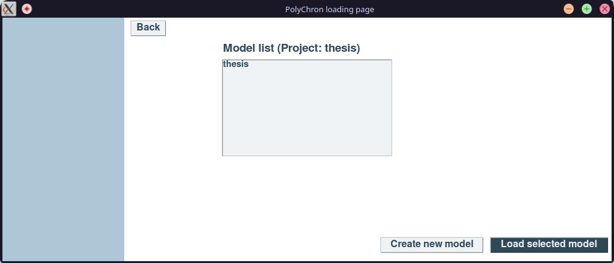

# Project loading


After launching PolyChron, users must create or select a **Project** and a **Model** to proceed.


## Project

In PolyChron, a **Project** is a named collection of **Models** for the same archaeological site, which are stored in the same directory on disk.

The *project* name must be a valid directory name for your filesystem.

The files for the project are stored on-disk within the polychron `projects_directory`, which defaults to `~/Documents/polychron/projects` but can be [configured](./configuration.md).

## Model

A PolyChron **Model** contains all of the data and information for a single chronological model and is a member of a project.

The *model* name must be a valid directory name for your filesystem, and is stored within the *project directory*.

## Creating a new project

From the project selection welcome screen, you can choose to **Create a new project**.
You will then be asked to provide a name for the new project.


After a project name is provided, such as `thesis`, you will be asked to provide a *Model* name for a new model within the project.


Entering a *model* name and selecting **Submit** will allow you to proceed to [*prior elicitation*](./prior-elicitation.md).

## Selecting an existing project

From the project selection welcome screen, you can choose to **Load existing project**.
You will then be asked to select a project from the list of projects in your `projects_directory`.


After selecting a project from the list, and selecting **Load Project**, a list of existing *models** within the *project* will be displayed.



You can either:

- select an existing model from the list and press **Load selected model** to proceed to [*prior elicitation*](./prior-elicitation.md);
- or you can create a new model by selecting **Create new model**, provide a *model* name, and press **Submit** to proceed to [*prior elicitation*](./prior-elicitation.md)

## Creating or Selecting a Project and Model from the command line

When launching polychron from the command line, a project name and model name may be provided, which will launch polychron and either select or create the specified project/model.

```bash
polychron --project PROJECT --model MODEL
polychron -p PROJECT -m MODEL
```

## Reopen the project selection window

If you close the project selection window before a model has been selected, it can be re-opened from the main application window using `File > Select Project`.

## Next

When you have created or selected a model, [proceed to *prior elicitation*](./prior-elicitation.md).
